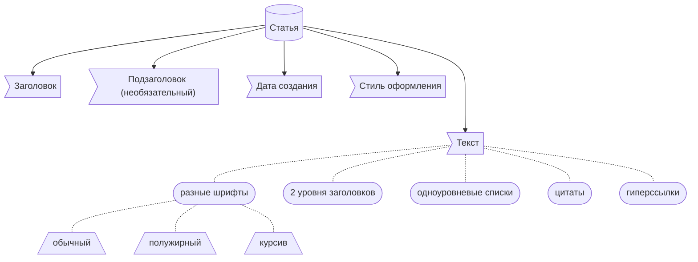

# Backend для «Хакатон Осень 2023»
<p align="center">
    <a href="https://github.com/nginx/nginx" alt="Nginx Logo" style="text-decoration: none">
        </a>
    <a href="https://github.com/tiangolo/fastapi" alt="FastAPI Logo">
        </a>
    <a href="https://github.com/sqlite/sqlite" alt="SQLite Logo">
        </a>
    <a href="https://github.com/sqlalchemy/alembic" alt="Alembic Logo">
        </a>
    <a href="https://github.com/sqlalchemy/sqlalchemy" alt="SQLAlchemy Logo">
        </a>
</p>



**Кейс**: Площадка для публикации и просмотра статей, минималистичный аналог Telegraph

:coffee: *Функциональные* требования:
- отсутствие элементов управления
- отсутствие возможности объединения статей в группы/иерархии
- URL статьи генерируется автоматически из заголовка и даты публикации

:teapot: *Нефункциональные* требования:
- использовать MVC
- разделить backend и frontend
- вынести бизнес-логику в сервисный слой
- выложить решение на сервер

## :rocket: Шаги для старта
1. ```git clone ссылка_на_репозиторий``` —— скачать исходный код
1. ```cd /путь/к/проекту``` —— перейти в папку с проектом
1. ```pip install -r requirements.txt``` —— установить необходимые библиотеки
1. ```cd src``` —— перейти в папку с основной частью проекта
1. ```uvicorn main:app --reload``` —— запустить backend
1. перейти на [localhost:8000](http://localhost:8000), т.е. запущенное приложение

## :dart: Эндпоинты
> [!NOTE]
> Информацию об эндпоинтах можно посмотреть в документации OpenAPI `/docs` или `/redoc`
- получение статьи по ID
  ```js
  GET /article/{article_id}
  { }
  ```
  ```js
  200 OK
  {
      "data": {
          "id": string,
          "creation_date": string,
          "title": string
          "subtitle": string,
          "content": string,
          "theme": string
      }
  }
  ```
- создание новой статьи
  ```js
  POST /article/create
  {
      "data": {
          "title": string,
          "subtitle": string,
          "content": string,
          "theme": string
      }
  }
  ```
  ```js
  200 OK
  {
      "data": {
          "article_id": string
      }
  }
  ```

## :mega: Виды ответов
- Успешный
  ```js
  200 OK
  {
      "data": dict
  }
  ```
- Ошибка валидации Pydantic
  ```js
  422 Unprocessable entity
  {
      "error": {
          "status_code": 422,
          "message": {
              incorrect_value: string message
          }
      }
  }
  ```
- Другая ошибка
  ```js
  http status code
  {
      "error": {
          "status_code": int,
          "message": string or dict
      }
  }
  ```
